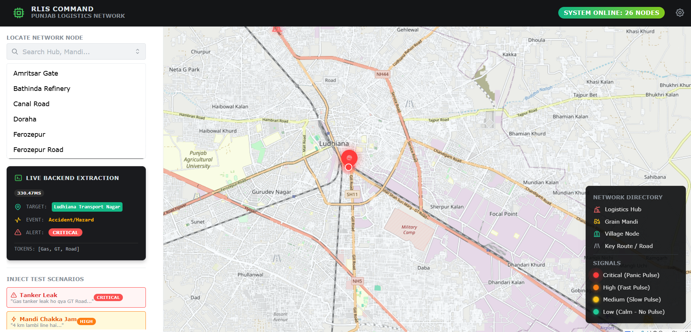
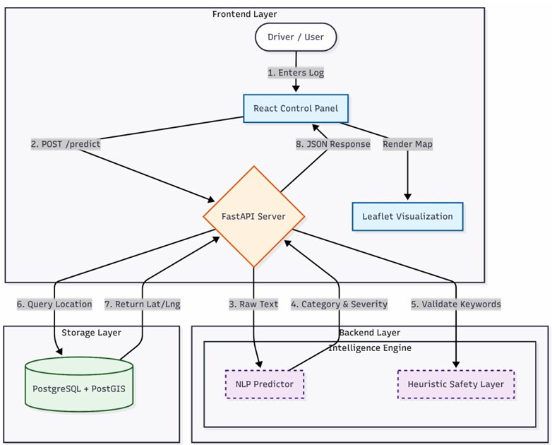

# 🚚 RLIS — Rural Logistics Intelligence System (Punjab)
*An AI-powered geospatial command center that turns messy rural driver logs into live, explainable, actionable intelligence.*


## 🧐 The Problem
In rural logistics, trucks don't just stop — they get stuck due to:
- Traffic jams (`chakka jam`)
- Protests (`dharna`)
- Accidents (`gaadi palat gayi`)
- Broken roads (`road band`)
- Local chaos

**The challenge:** Reasons are buried in messy, unstructured **Hinglish logs** that traditional GPS systems ignore:

> `"Moga mandi ke bahar chakka jam hai"`
> `"Truck fas gaya, road band"`
> `"Accident ho gaya, gaadi palat gayi"`

Traditional systems only show *where* the truck is.

**RLIS tells you *why* it's stuck.**

## 🖥️ Dashboard Preview


*Live command center with geospatial visualization, Glass Box reasoning, and real-time incident feed*

## 📊 System Flowchart


*High-level data & control flow: Frontend → Backend → NLP Pipeline → Database → Visualization*

## 🧠 What RLIS Does
1. **Ingests** raw Hinglish/English driver logs
2. **Processes** through custom NLP + heuristic pipeline
3. **Extracts**:
   - Incident type (Jam, Accident, Protest, Fire, etc.)
   - Severity (Low/Medium/High/Critical)
   - Affected location node
4. **Visualizes** everything live on a geospatial Punjab map
5. **Exposes** AI reasoning via Glass Box panel

## ✨ Key Features
| Feature | Description |
|---------|-------------|
| ✅ **Hinglish Understanding** | Parses rural slang like "chakka jam", "fas gaye", "palat gayi" |
| ✅ **Hybrid Intelligence** | ML classifier + deterministic safety layer |
| ✅ **Physics-Based Visualization** | Severity-driven pulsing animation |
| ✅ **Explainable AI** | Glass Box panel shows reasoning |
| ✅ **Spatial Intelligence** | PostGIS-powered location queries |
| ✅ **Production Ready** | Fully Dockerized, reproducible system |

### 🎨 Severity Visualization System
- **🔴 Critical** = aggressive fast pulse
- **🟠 High** = medium pulse
- **🟡 Medium** = slow pulse
- **🟢 Low** = calm / static

## 🏗️ System Architecture
React (Vite) Frontend  
↓  
FastAPI Backend  
↓  
PostgreSQL + PostGIS  
↓  
NLP Pipeline + Heuristic Safety Engine

## 🛠️ Tech Stack
| Layer | Technology |
|-------|------------|
| **Frontend** | React + Vite + Mantine UI + React-Leaflet |
| **Backend** | FastAPI (Python 3.11) |
| **Database** | PostgreSQL + PostGIS |
| **AI/NLP** | Scikit-learn (N-grams + TF-IDF), Multinomial Naive Bayes |
| **Infrastructure** | Docker + Docker Compose |

## 🚀 Quick Start
```bash
# Clone and run
git clone <repository-url>
cd rlis-punjab
docker compose up --build
```

Access points:  
- Frontend: <http://localhost:3000>  
- Backend API: <http://localhost:8000/api/v1>  
- API Docs: <http://localhost:8000/docs>  

### ⚙️ Environment Configuration
```yaml
# Optional docker-compose.yml overrides
DB_WAIT_RETRIES: 60 # Database connection retries
DB_WAIT_SLEEP: 2 # Seconds between retries
```

## 🧪 System Behavior Flow
- Default state: All 22 Punjab nodes visible, calm map
- Active state: Log → AI processes → Node lights up → Pulse animation → Feed updates

## 🧠 Technical Deep Dive
### NLP Pipeline Architecture
- Vectorization: CountVectorizer with N-grams (1, 2)
- Weighting: TfidfTransformer for signal boosting
- Classification: Multinomial Naive Bayes (<10ms inference)
- Safety Layer: Keyword override for critical events

### Frontend Components
| Component | Purpose |
|-----------|---------|
| App.jsx | State orchestrator & layout manager |
| ControlPanel.jsx | User interaction & Glass Box display |
| LogisticsMap.jsx | Geospatial rendering engine |
| api.js | HTTP networking bridge |

### Database Schema
- `locations`: Static Punjab nodes (hubs, mandis, villages)
- `incidents`: Live log entries with geospatial metadata

### Visual Design System
- Theme: "Cyber-Logistics" aesthetic
- Colors: Deep dark backgrounds with neon accents
- Icons: Custom SVG markers for different location types
- Animations: CSS @keyframes for severity pulses

## 🎯 Why This Matters
This is real applied AI, not a toy demo:  
- Handles Real-World Messiness: Ambiguous Hinglish text, rural slang  
- Safety-First Design: 100% recall for critical events via heuristic layer  
- Operator Trust: Explainable AI builds confidence in predictions  
- Production Ready: Dockerized, scalable, with spatial indexing  
- Actionable Intelligence: Turns raw logs into visual command center insights  

## 📁 Project Structure
```
rlis-punjab/
├── frontend/ # React Vite application
├── backend/ # FastAPI Python server
├── nlp_model/ # Trained ML models & vectorizers
├── assets/ # Images, diagrams, and visual assets
│   ├── demo.gif
│   ├── dashboard.png
│   ├── flowchart.png
├── docker-compose.yml # Multi-container orchestration
└── README.md # This document
```

## 🔮 Future Roadmap
- Real-time WebSocket updates
- Mobile driver app integration
- Predictive delay forecasting
- Multi-state expansion beyond Punjab
- Weather integration for flood alerts

## 📄 License
MIT License - see LICENSE file for details

## 👥 Acknowledgments
Built for the unique challenges of rural Indian logistics.  
Special thanks to logistics operators in Punjab for domain insights.

🚀 Turning rural chaos into actionable intelligence, one log at a time.
